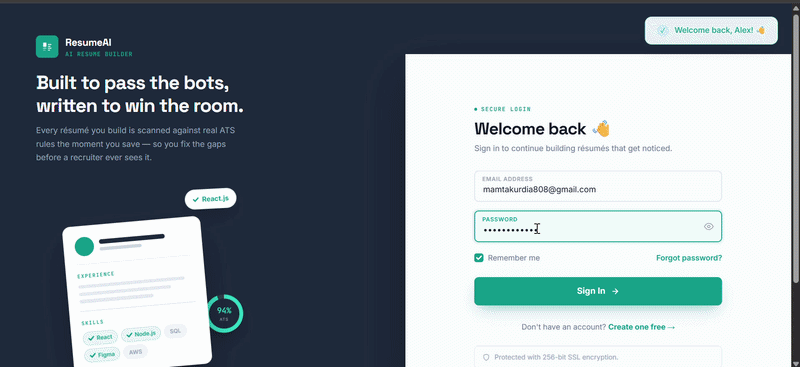
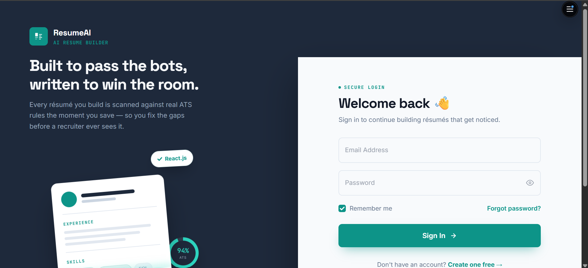
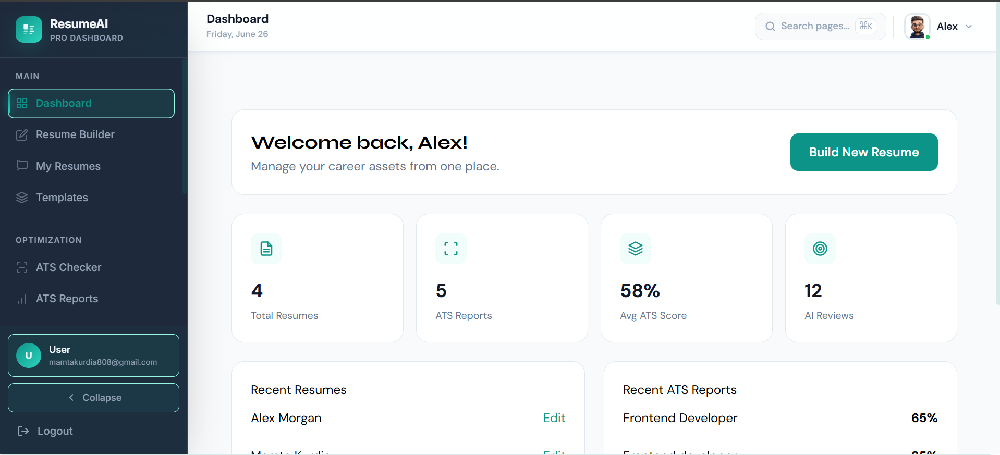
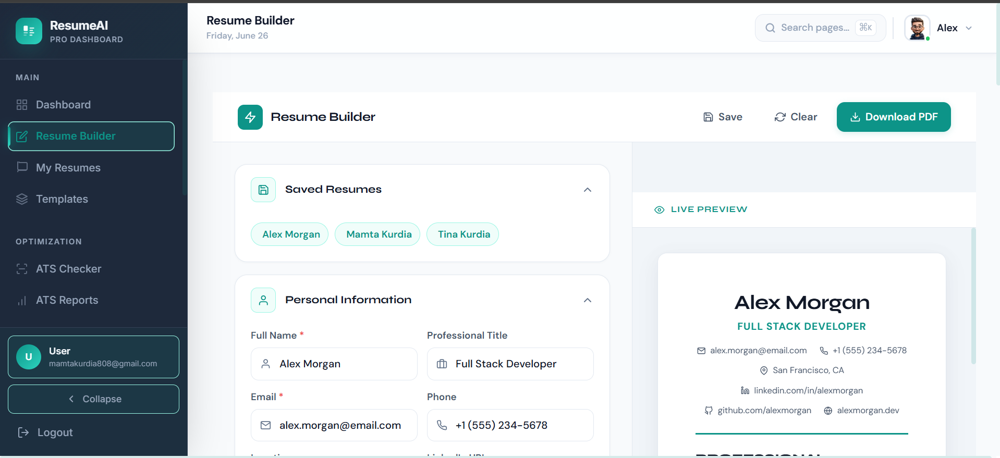
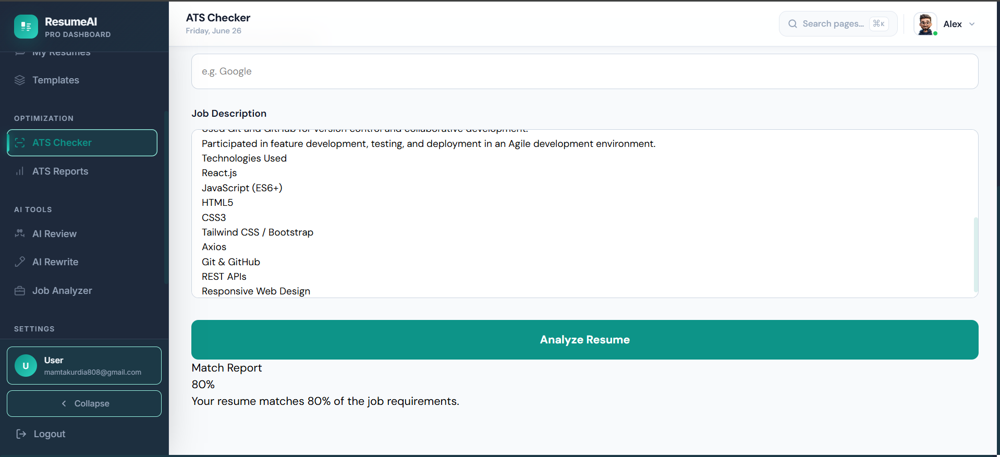
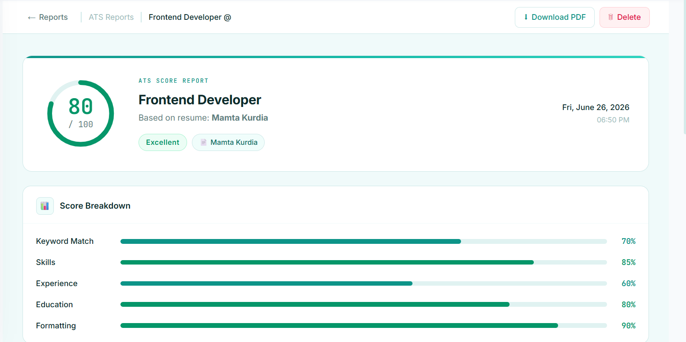
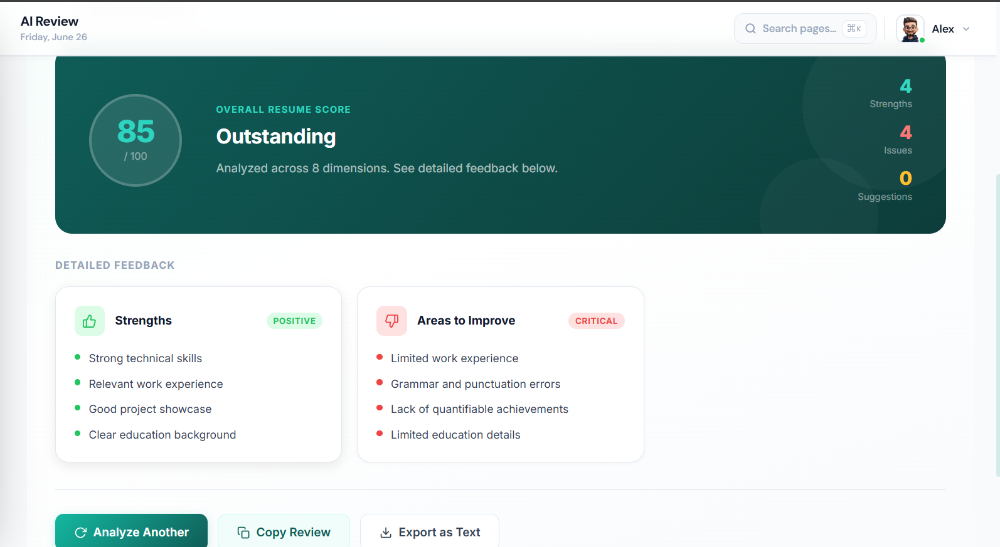
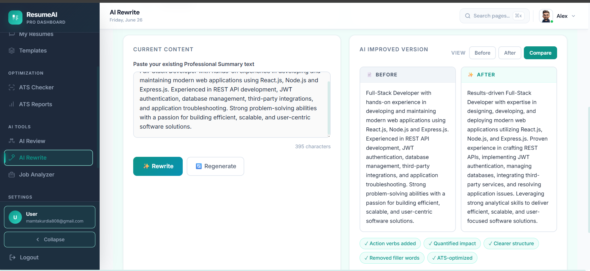

# ResumeAI – AI Resume Builder & ATS Resume Checker


ResumeAI is a full-stack AI-powered web application that enables users to build professional resumes, analyze ATS compatibility, receive AI-generated resume reviews, and rewrite resume content for improved job application success. Built with React, Node.js, Express, PostgreSQL, and Groq AI, it offers secure authentication, cloud-based profile management, and a responsive user experience.

---

## Live Demo

https://resume-builder-nu-eight-48.vercel.app/

## Demo

<p align="center">
  
</p>

---

## Features

- AI-powered Resume Review
- ATS Resume Checker
- ATS Score & Detailed Report
- AI Resume Rewriter
- Professional Resume Builder
- Multiple Resume Templates
- Live Resume Preview
- User Authentication (JWT)
- Profile Management
- Cloudinary Profile Image Upload
- Resume CRUD Operations
- Responsive Design
- Secure REST APIs

---

## Tech Stack

### Frontend
- React
- Vite
- React Router
- Axios

### Backend
- Node.js
- Express.js
- JWT Authentication
- Multer

### Database
- PostgreSQL
- Neon Database

### AI Integration
- Groq API

### Cloud Storage
- Cloudinary

### Tools
- Git
- GitHub
- npm

---

## Project Structure

```
ResumeAI
│
├── frontend
│   ├── src
│   ├── public
│   └── package.json
│
├── backend
│   ├── controllers
│   ├── routes
│   ├── middleware
│   ├── models
│   ├── config
│   ├── uploads
│   └── package.json
│
└── README.md
```

---

## Screenshots

| Landing Page | Dashboard |
|--------------|-----------|
|  |  |

| Resume Builder | ATS Checker |
|----------------|-------------|
|  |  |

| ATS Report | AI Review |
|------------|-----------|
|  |  |

| AI Rewrite |
|------------|
|  |

---

## Installation

### Clone Repository

```bash
git clone https://github.com/mamtakurdia808-code/resume-builder.git
```

### Frontend

```bash
cd frontend
npm install
npm run dev
```

### Backend

```bash
cd backend
npm install
npm run dev
```

---

## Key Functionalities

- Create and manage multiple resumes
- Edit resumes in real time
- Live resume preview
- AI-powered resume analysis
- ATS compatibility checking
- AI resume rewriting
- Secure login and registration
- Upload and manage profile images
- Responsive interface
- Cloud database integration

---

## Author

**Mamta Kurdia**

- GitHub: https://github.com/mamtakurdia808-code
- LinkedIn: https://www.linkedin.com/in/mamta-kurdia808

⭐ If you like this project, consider starring the repository.

---

## License

This project is intended for learning and portfolio purposes.
